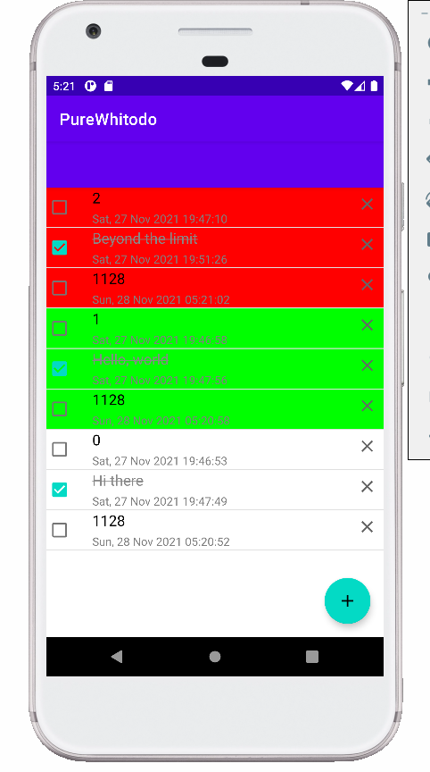
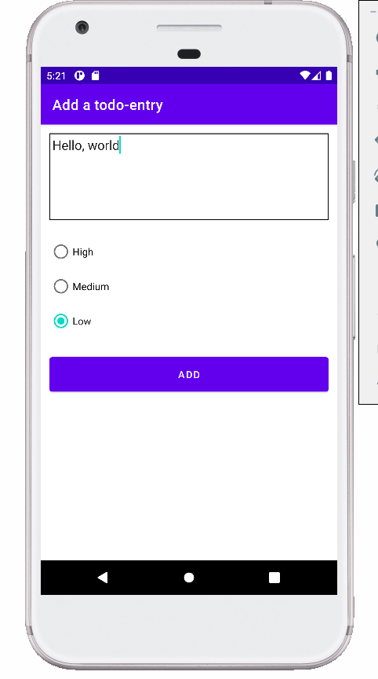

# CS175 Assignment 5

519021910529, Qi Liu, purewhite@sjtu.edu.cn

This is an assignment of Chapter 6 in CS175, *Practice on Android Application Development*, Autumn 2021.

A simple todo-list app is implemented with all tasks finished, including:

1. Store todo entries in a database built with *Room API*, with the ability to query, insert, update and delete entries.
1. Show all todo entries in a sorted manner (Based on the priority and the creation time) in the main activity.
1. Add new todo entries by clicking $\oplus$ button.
1. Set a certain todo entry to be done or undone by clicking the checkboxes, updating the database and the UI meanwhile.
1. Delete a certain todo entry by clicking $\times$ button, updating the database and the UI meanwhile.

**Fig. 1** *The `MainActivity`*

**Fig. 2** *The `AddTodoActivity`*

