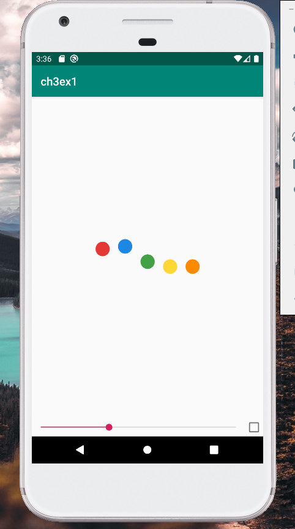
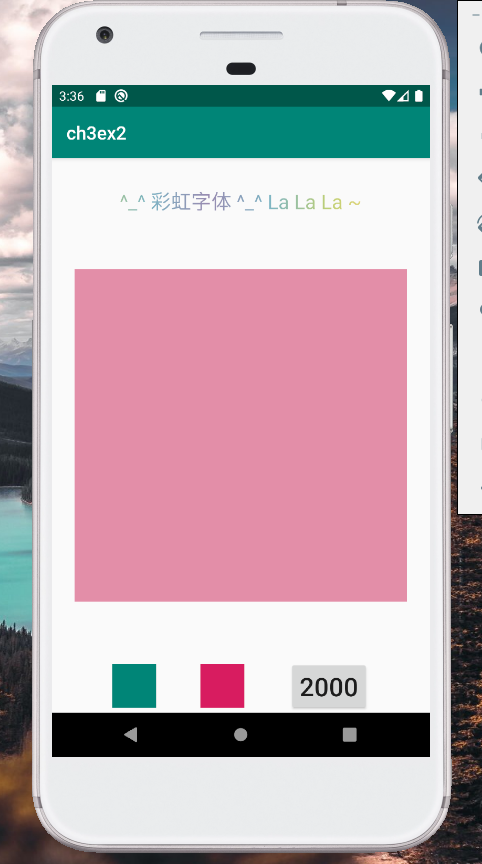
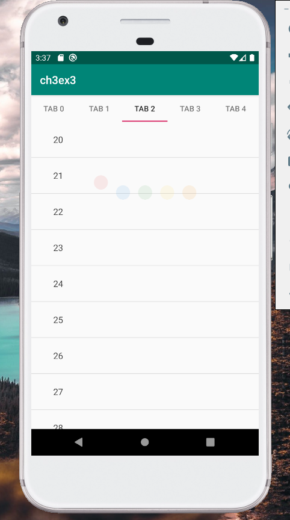

# CS175 Assignment 2

519021910529, Qi Liu, purewhite@sjtu.edu.cn

This is an assignment of Chapter 3 in CS175, *Practice on Android Application Development*, Autumn 2021.

All tasks have been finished, including:

- **ex-1**: Used *lottie* to play animations;
- **ex-2**:
  - Implemented an *ObjectAnimator* to scale a *View*; 
  - Implemented an *ObjectAnimator* to change the opacity of a *View*; 
  - Used *AnimatorSet* to wrap all *ObjectAnimator*s;
  - Made the *RainbowTextView* visible;
- **ex-3**: 
  - Implemented a slide-switch interface with *ViewPager* and *Fragment*;
  - Implemented a tab with *TabLayout*;
  - Added a loading animation and *ListView* into `fragment_placeholder`;
  - Implemented fading-in and fading-out animations to smoothly switch between the loading animation and  the *ListView*;

Example figures are shown as follows.

<b>ex-1</b>

<b>ex-2</b>

<b>ex-3</b>

