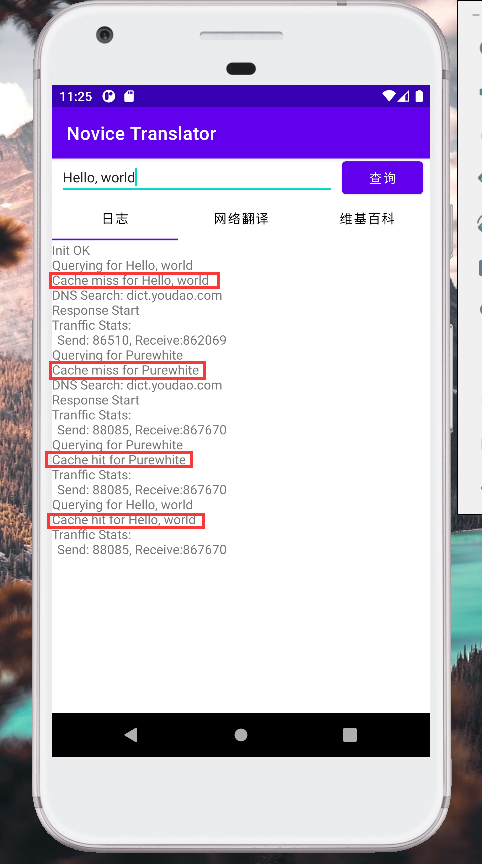
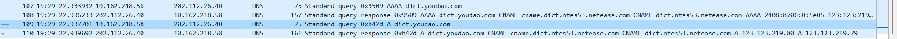
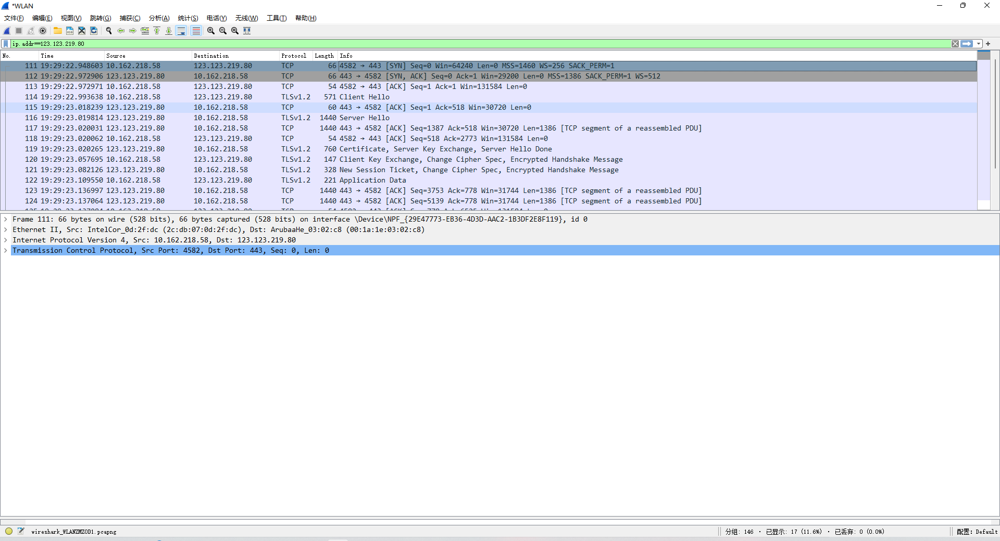

# CS175 Assignment 4

519021910529, Qi Liu, purewhite@sjtu.edu.cn

This is an assignment of Chapter 5 in CS175, *Practice on Android Application Development*, Autumn 2021.

A simple translator is implemented with all tasks finished, including:

1. Translate words and sentences from English to Chinese, with Network Translation.
2. Show Wikipedia Digestion of a certain word or sentence.
3. Cache results to alleviate network burden.
4. Show traffic stats to analyze network usage.
5. Capture DNS, TCP and TLS packets with Wireshark.

**Fig. 1** *Example of Network Translation*

**Fig. 2** *Example of Wikipedia Digestion*

**Fig. 3** *Example of cache and traffic stats*

**Fig. 4, 5** *DNS, TCP and TLS* packets on this connection

