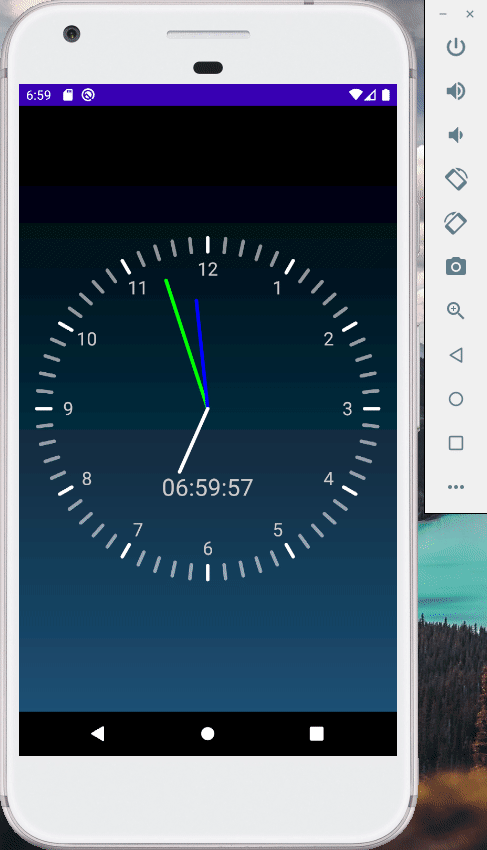

# CS175 Assignment 3

519021910529, Qi Liu, purewhite@sjtu.edu.cn

This is an assignment of Chapter 4 in CS175, *Practice on Android Application Development*, Autumn 2021.

A clock app is implemented with all tasks finished, including:

- **Basic**:

  - [x] Draw a clock interface, including dial, hour hand, minute hand and second hand 
  - [x] Hour hand, minute hand and second hand change over time

- **Additional**:

  - [x] Number indices on the dial

  - [x] An extra digital clock synchronized with the mechanical clock

  - [x] A mode which allows manual adjustment for the time, implemented by *Touch* event

    The areas from outer to inner are used for adjusting the second, the minute, the hour and changing back to system time, respectively.

- **Experiment**:

  - [x] The app will not crash when the second reaches 60, the minute reaches 60 or the hour reaches 12, as the example gif shows.

#### Example

