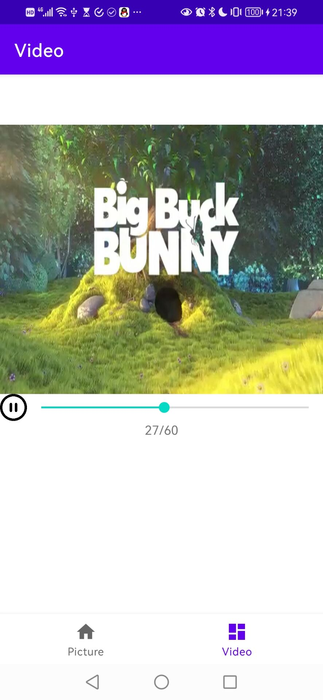

# CS175 Assignment 7

519021910529, Qi Liu, purewhite@sjtu.edu.cn

This is an assignment of Chapter 8 in CS175, *Practice on Android Application Development*, Autumn 2021.

A simple camera app is implemented with all tasks finished, including:

	1. Camera functions well-implemented with *Camera 2* API.
	1. A beautified `Edittext` for specifying the output file name. (By default, the output file name is current time)
	1. A `TextureView` to preview the camera result.
 	4. A `TextView` to show information about last shoot.
	1. An `ImageButton` to switch between the front camera and the back camera.
	1. An `ImageButton`, clicking which will take a photo and long clicking will record a video (video recording ends upon the click ends).
	1. An `ImageView` storing the thumbnail of last shot.

**Fig. 1** *Photo Shot with Front Camera*

**Fig. 2** *Video Shot with Front Camera*

**Fig. 3** *Photo Shot with Back Camera*

**Fig. 4** *Video Shot with Back Camera*

