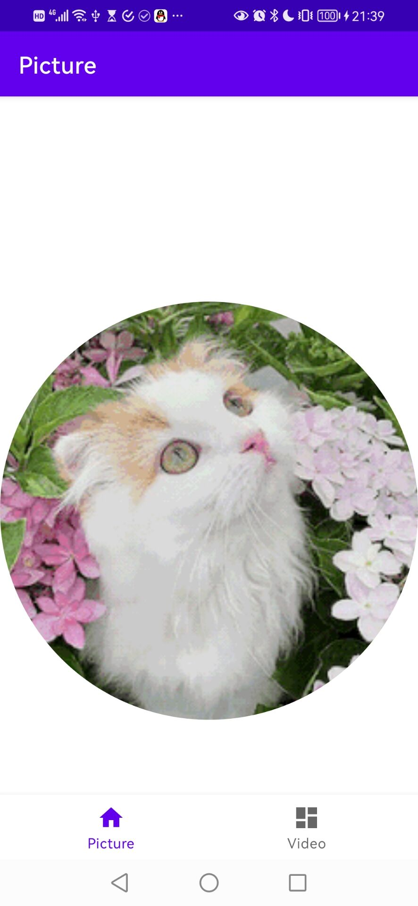

# CS175 Assignment 6

519021910529, Qi Liu, purewhite@sjtu.edu.cn

This is an assignment of Chapter 7 in CS175, *Practice on Android Application Development*, Autumn 2021.

A simple multimedia app is implemented with almost all tasks finished, including:

1. Picture Gallery
   - Show pictures from the Internet (both static and dynamic pictures supported).
   - Swipe left/right/up/down to switch between pictures.
   - Use 2-finger gesture to scale and translate the pictures.

2. Video Player
   - Start and Pause the video player. (Progress bar can be used to restart the video, thus a separated button is deprecated)
   - Adjust the progress of the video with a progress bar according to clicking or dragging actions.

**Fig. 1** *`PictureFragment` showing Dynamic Picture*

**Fig. 2** *`PictureFragment` showing Scaled and Translated Picture*

**Fig. 3** *`VideoFragment` Playing Video*

**Fig. 4** *`VideoFragment` Paused*

